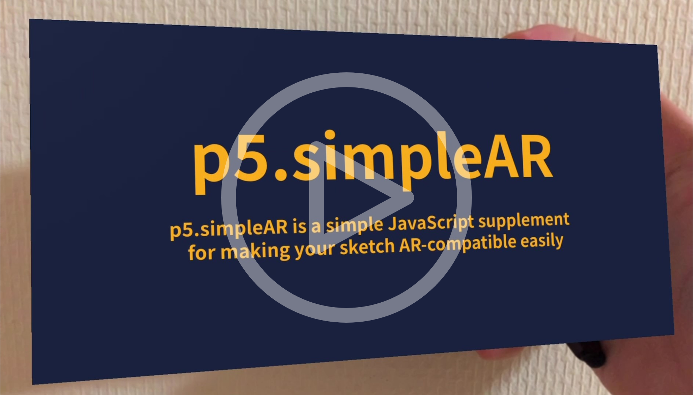
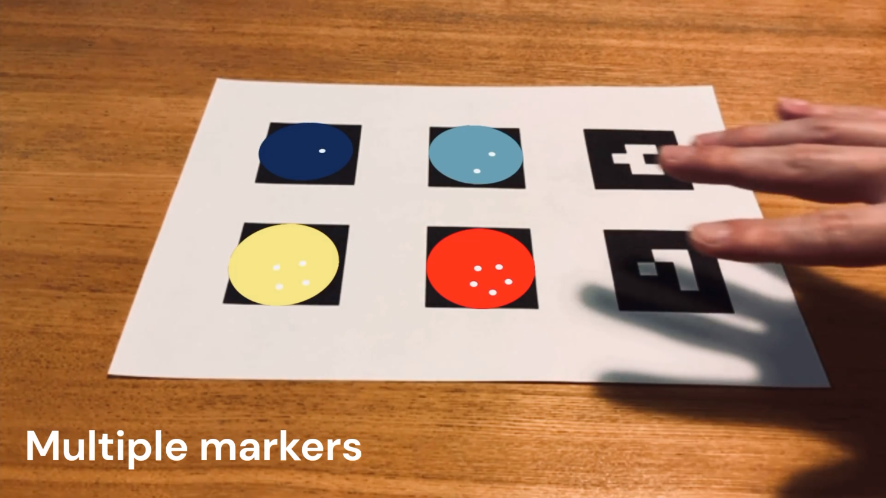
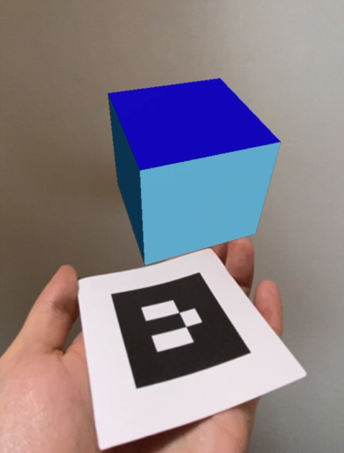
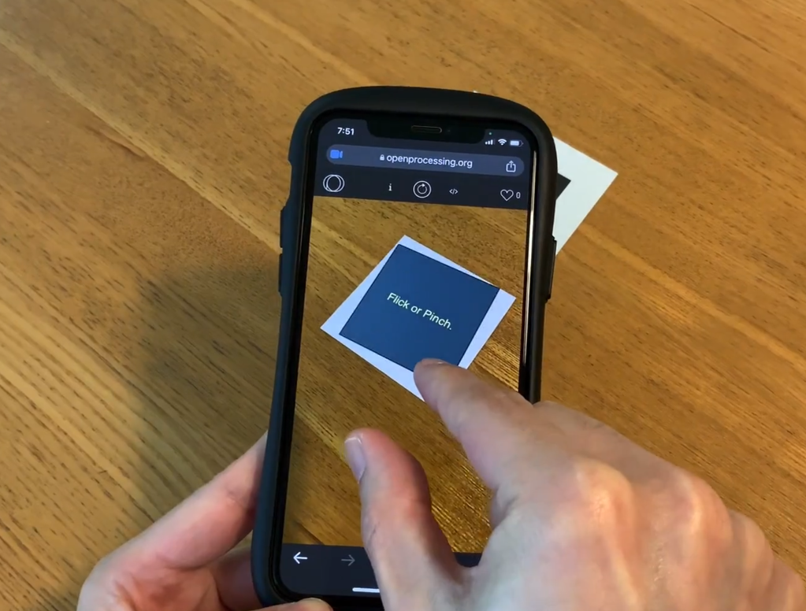
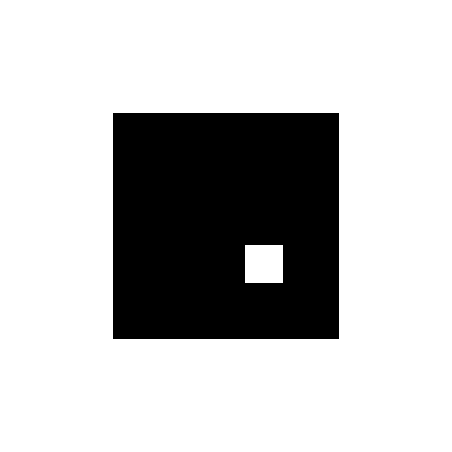

# Overview 👓

**p5.simpleAR** is a simple JavaScript supplement(mini-library) file to easily convert existing sketches into AR for PCs and smart devices.  
<a href="https://youtu.be/I2mgpdLRX3g"></a>  
[Concept movie.](https://youtu.be/I2mgpdLRX3g)

Now, the latest version is `0.7.0` (beta release).  
  
<details><summary>CLICK ME to show updates in detail</summary>

**New Features in `0.7.0`.**
- Support setting AR properties(position and rotation).

<a href="https://youtu.be/zTTUR7rV4xc"></a>  
[0.7.0 features movie.](https://youtu.be/zTTUR7rV4xc)

**New Features in `0.6.1`.**
- Support flick and pinch-in/out gesture.

<a href="https://youtu.be/ZlkeMeXEQfc"></a>  
[0.6.1 features movie.](https://youtu.be/ZlkeMeXEQfc)

**New Features in `0.6.0`.**
- Marker id can be specified.
- Support つぶやきProcessing sketches(`createARCanvas` can be called multiply.)
- `createARGraphics` enables us to use multiple markers simultaneously.
- Marker rotation and position info can be got.
- Add marker-found/lost event callback.

<a href="https://youtu.be/DhBOJwgIOP0"></a>  
[0.6.0 features movie.](https://youtu.be/DhBOJwgIOP0)

</details>

## Demos
First, Please print the marker(#6) below, or just view it on the phone.  
 

[Marker](https://tetunori.github.io/p5.simpleAR/markers/6wFrame.png)

### Basic Demo

https://user-images.githubusercontent.com/14086390/230766242-8c15c1ae-b734-4790-9f74-b3de3d875d8f.mp4

- [Basic Demo On GitHub](https://tetunori.github.io/p5.simpleAR/sample/basic/index.html), [Source code On GitHub](https://github.com/tetunori/p5.simpleAR/tree/main/sample/basic/)
- [Basic Demo On OpenProcessing](https://openprocessing.org/sketch/1891727)

### Other demos
<details><summary>CLICK ME to show other demos</summary>

#### Standard samples
##### [Garg with frame on WebAR](https://openprocessing.org/sketch/1891866)  

https://user-images.githubusercontent.com/14086390/230773531-c551cde0-014b-4e03-b839-120e3dd1594f.mp4

[Garg library](https://jp.deconbatch.com/2021/10/garg.html) by [@deconbatch](https://twitter.com/deconbatch)

##### [221105a on WebAR](https://openprocessing.org/sketch/1891678)  

https://user-images.githubusercontent.com/14086390/230766268-0836fc4d-a050-4c94-8485-4c8a0a1a8cb2.mp4

Original sketch by [@takawo](https://twitter.com/takawo)  

##### [Nagumo on WebAR](https://openprocessing.org/sketch/1891684)  

https://user-images.githubusercontent.com/14086390/230766284-756c01a2-37f0-4f53-955d-d511d16ac827.mp4

Original sketch by [@deconbatch](https://twitter.com/deconbatch)  

#### Transparent background
##### [Generativemasks on WebAR](https://openprocessing.org/sketch/1891862)

<a href="https://openprocessing.org/sketch/1891862"></a><br>
[Generativemasks](https://generativemasks.io/) by [@takawo](https://twitter.com/takawo), [Garg library](https://jp.deconbatch.com/2021/10/garg.html) by [@deconbatch](https://twitter.com/deconbatch)

#### Non-square canvas(800*80)
##### [Game of Life on WebAR](https://openprocessing.org/sketch/1891716)  

https://user-images.githubusercontent.com/14086390/230766289-28826124-1bbd-400a-bdb7-07e176d5e0d0.mp4


#### Multi Marker
##### [createARGraphics demo](https://openprocessing.org/sketch/1898840)

<a href="https://openprocessing.org/sketch/1898840"></a><br>

#### 3D properties
##### [Floating box Demo](https://openprocessing.org/sketch/1920132)

<a href="https://openprocessing.org/sketch/1920132"></a><br>

#### Gesture
##### [Gesture Demo](https://openprocessing.org/sketch/1905887)

<a href="https://openprocessing.org/sketch/1905887"></a><br>

</details>

# Usage
## Import
```html 
<script src="https://tetunori.github.io/p5.simpleAR/dist/v0.7.0/p5SimpleAR.js"></script>
```
<details><summary>In case of OpenProcessing</summary>
 
</details>

## Basic Usage
Just replace `createCanvas` with `createARCanvas`.

```javascript
createCanvas(100, 100);
->
createARCanvas(100, 100);
```
OK, done.  
Then, your sketch will be shown on the [AR Marker](https://tetunori.github.io/p5.simpleAR/markers/6wFrame.png).

## Environment 
This function deeply depends on **AR.js**. Please see the [requirement](https://ar-js-org.github.io/AR.js-Docs/#requirements) of the library. 

# API Specification
<details><summary>CLICK ME</summary>
<p>

## Markers
We can choose markers from the 64 images below.  
[AR Markers](https://github.com/tetunori/p5.simpleAR/tree/main/markers/) 

|  0  |  1  |  ...  |  63  |
| :---: | :---: | :---: | :---: |
|  |  |  ...  |   |

## createARCanvas

```javascript
createARCanvas(w, h, [renderer], [params])
```

Replace `createCanvas` with this function.  
So, basically, this API has same parameters as `createCanvas`.  
> **Warning**  
> AR function does not work well in `WEBGL` mode...

`params` is an original `Object` parameter for `p5.simpleAR`.  
### Properties:
|  name  |  note  |
| ---- | ---- |
|  `scale`   | `Number`: Scale of the sketch. Marker(3x3 dots) size is defined as `1`. Default value is `3`. |
|  `opacity`   | `Number`: Opacity of the sketch. Input a value between `0.0` and `1.0`. Default value is `1.0`. |
|  `markerId`   | `Number`: Id of the marker data. Input a integer value between `0` and `63`. Default value is `6`. |

```javascript
// Call like this
// createCanvas(100, 200);
createARCanvas(100, 200, P2D, { scale: 5, opacity: 0.7, markerId: 1 });
```

### Sample
- createARCanvas Demo
  - [On GitHub](https://tetunori.github.io/p5.simpleAR/sample/parameters/index.html), [Source code On GitHub](https://github.com/tetunori/p5.simpleAR/tree/main/sample/parameters/)
  - [On OpenProcessing](https://openprocessing.org/sketch/1898838)
- つぶやきProcessing Demo
  - [Demo On GitHub](https://tetunori.github.io/p5.simpleAR/sample/tsubuyaki/index.html), [Source code On GitHub](https://github.com/tetunori/p5.simpleAR/tree/main/sample/tsubuyaki/)
  - [On OpenProcessing](https://openprocessing.org/sketch/1899101)

## createARGraphics

```javascript
createARGraphics(w, h, [renderer], [params])
```

Replace `createGraphics` with this function.  
So, basically, this API has same parameters as `createGraphics`.  
By using this API, You can handle multiple markers. 
> **Warning**  
> AR function does not work well in `WEBGL` mode...

> **Warning**  
> `createARGraphics` and `createARCanvas` cannot coexist.

`params` is an original `Object` parameter for `p5.simpleAR`.  
### Properties:
|  name  |  note  |
| ---- | ---- |
|  `scale`   | `Number`: Scale of the sketch. Marker(3x3 dots) size is defined as `1`. Default value is `3`. |
|  `opacity`   | `Number`: Opacity of the sketch. Input a value between `0.0` and `1.0`. Default value is `1.0`. |
|  `markerId`   | `Number`: Id of the marker data. Input a integer value between `0` and `63`. Default value is `6`. Be sure to set unique id for each graphics. |

```javascript
// Call like this
// createGraphics(100, 200);
createARGraphics(100, 200, P2D, { scale: 5, opacity: 0.7, markerId: 1 });
```

### Sample
- createARGraphics Multi Marker Demo
  - [On GitHub](https://tetunori.github.io/p5.simpleAR/sample/createARGraphics/index.html), [Source code On GitHub](https://github.com/tetunori/p5.simpleAR/tree/main/sample/createARGraphics/)
  - [On OpenProcessing](https://openprocessing.org/sketch/1898840)

## p5SimpleARGetMarkerProperty
```javascript
p5SimpleARGetMarkerProperty([markerId])
```
Return a `Object` that has some information on the specified marker.

### Parameter:
|  name  |  note  |
| ---- | ---- |
|  `markerId`   | `Number`: Id of the marker data. If you do not specify this, default value `6` will be set. |

### Return Object Property:
|  name  |  note  |
| ---- | ---- |
|  `markerId`   | `Number`: Id of the specified marker data. |
|  `markerVisible`   | `Boolean`: Whether the specified marker is visible or not. |
|  `rotation`   | `Object`: Rotation information of the marker. Value format(radians/degrees) depends on the p5.js angle-mode setting(see [angleMode()](https://p5js.org/reference/#/p5/angleMode)). <br> **Property:**<br>x: Pitch, rotation about the X-axis.<br>y: Yaw, rotation about the Y-axis.	<br>z: Roll, rotation about the Z-axis. |
|  `position`   | `Object`: Position information of the marker. This uses a right-handed coordinate system where the negative Z axis extends into the screen. <br> **Property:**<br>x: Negative X axis extends left. Positive X Axis extends right.<br>y: Negative Y axis extends down. Positive Y Axis extends up.	<br>z: Negative Z axis extends in. Positive Z Axis extends out. |

```javascript
const markerProps = p5SimpleARGetMarkerProperty(6);
```
Received `Object` consists of objects as below.

```javascript
// Return value of p5SimpleARGetMarkerProperty() with angleMode 'DEGREES'
{
  markerId: 6,
  markerVisible: true,
  rotation: {
    x: 105.35504555645193, 
    y: -11.201540264006956, 
    z: 14.797999140808324,
  },
  position: {
    x: -0.2322715400514963, 
    y: 0.956252183544887, 
    z: -12.228084209054696,
  }
}
```

### Sample
- Simple GetMarkerProperty Demo
  - [On GitHub](https://tetunori.github.io/p5.simpleAR/sample/getMarkerProperty/index.html), [Source code On GitHub](https://github.com/tetunori/p5.simpleAR/tree/main/sample/getMarkerProperty/)
  - [On OpenProcessing](https://openprocessing.org/sketch/1899122)

- Position/Rotation Demo
  - [On GitHub](https://tetunori.github.io/p5.simpleAR/sample/propPosRot/index.html), [Source code On GitHub](https://github.com/tetunori/p5.simpleAR/tree/main/sample/propPosRot/)
  - [On OpenProcessing](https://openprocessing.org/sketch/1899120)

## p5SimpleARSetARProperty
```javascript
p5SimpleARSetARProperty(prop, [markerId])
```
Set AR poperties(rotation and position).

### Parameter:
|  name  |  note  |
| ---- | ---- |
|  `prop`   | `Object`: AR Properties to be set. See the table below in detail. |
|  `markerId`   | `Number`: Id of the marker data. If you do not specify this, default value `6` will be set. |

#### `prop` Properties:
|  name  |  note  |
| ---- | ---- |
|  `rotation`   | `Object`: Rotation information of the AR canvas. Value format(radians/degrees) depends on the p5.js angle-mode setting(see [angleMode()](https://p5js.org/reference/#/p5/angleMode)). <br> **Property:**<br>x: rotation about the X-axis.<br>y: rotation about the Y-axis.	<br>z: rotation about the Z-axis.	 <br>order: rotation order default value is `'XYZ'`. |
|  `position`   | `Object`: Position information of the AR canvas.  <br> **Property:**<br>x: translation in the X-axis direction.<br>y: translation in the Y-axis direction.	<br>z: translation in the Z-axis direction. |

```javascript
const arProps = {
  rotation: {
    x: PI/4,
    y: 0,
    z: -PI/2,
    order: 'ZYX',
  },
  position: {
    x: 0,
    y: 1,
    z: 2,
  },
};

p5SimpleARSetARProperty(arProps);
```

Combined with `p5SimpleARGetMarkerProperty()`, we can make use of existing 3D `p5.js` sketches as it is.  
```javascript
// Get current marker poperty
const markerProps = p5SimpleARGetMarkerProperty();

// AR properties
const arProps = {
  // Rotate canvas so that it always faces the camera.
  // Default rotation order is 'XYZ' so we should use 'ZYX' to get back.
  rotation: {
    x: -markerProps.rotation.x,
    y: -markerProps.rotation.y,
    z: -markerProps.rotation.z,
    order: 'ZYX',
  },
  position: {
    x: 0,
    y: 1,
    z: 0,
  },
};
p5SimpleARSetARProperty(arProps);

// Rotate objects in canvas
rotateX(PI - markerProps.rotation.x);
rotateY(PI - markerProps.rotation.y);
rotateZ(PI - markerProps.rotation.z);

// draw!
box(70);
```

### Sample
- Simple SetARProperty Demo
  - [On GitHub](https://tetunori.github.io/p5.simpleAR/sample/setARProperty/index.html), [Source code On GitHub](https://github.com/tetunori/p5.simpleAR/tree/main/sample/setARProperty/)
  - [On OpenProcessing](https://openprocessing.org/sketch/1920131)

- Floating box Demo
  - [On GitHub](https://tetunori.github.io/p5.simpleAR/sample/floatingBox/index.html), [Source code On GitHub](https://github.com/tetunori/p5.simpleAR/tree/main/sample/floatingBox/)
  - [On OpenProcessing](https://openprocessing.org/sketch/1920132)

- BMWalker Demo
  - [On GitHub](https://tetunori.github.io/p5.simpleAR/sample/bmwalker/index.html), [Source code On GitHub](https://github.com/tetunori/p5.simpleAR/tree/main/sample/bmwalker/)
  - [On OpenProcessing](https://openprocessing.org/sketch/1920133)

## p5SimpleAREnableGesture
```javascript
p5SimpleAREnableGesture([bEnable])
```
Enable/disalbe flick and pinch-in/out gesture to rotate or zoom-in/out.

### Parameter:
|  name  |  note  |
| ---- | ---- |
|  `bEnable`   | `Boolean`: Specify enable(`true`) or disable(`false`). |

```javascript
p5SimpleAREnableGesture(true);
```

### Sample
- Gesture Demo
  - [On GitHub](https://tetunori.github.io/p5.simpleAR/sample/enableGesture/index.html), [Source code On GitHub](https://github.com/tetunori/p5.simpleAR/tree/main/sample/enableGesture/)
  - [On OpenProcessing](https://openprocessing.org/sketch/1905887)

## p5SimpleARMarkerFound
```javascript
p5SimpleARMarkerFound([markerId])
```
The `p5SimpleARMarkerFound` function is called once when a specified marker has been found.

### Parameter:
|  name  |  note  |
| ---- | ---- |
|  `markerId`   | `Number`: Id of the found marker. |

```javascript
// Overwrite like below.
function p5SimpleARMarkerFound(markerId) {
  console.log('p5SimpleARMarkerFound: ' + markerId);
}
```

### Sample
- Found/Lost callback Demo
  - [On GitHub](https://tetunori.github.io/p5.simpleAR/sample/foundLost/index.html), [Source code On GitHub](https://github.com/tetunori/p5.simpleAR/tree/main/sample/foundLost/)
  - [On OpenProcessing](https://openprocessing.org/sketch/1899233)

## p5SimpleARMarkerLost
```javascript
p5SimpleARMarkerLost([markerId])
```
The `p5SimpleARMarkerLost` function is called once when a specified marker has been lost.

### Parameter:

|  name  |  note  |
| ---- | ---- |
|  `markerId`   | `Number`: Id of the lost marker. |

```javascript
// Overwrite like below.
function p5SimpleARMarkerLost(markerId) {
  console.log('p5SimpleARMarkerLost: ' + markerId);
}
```

### Sample
- Found/Lost callback Demo
  - [On GitHub](https://tetunori.github.io/p5.simpleAR/sample/foundLost/index.html), [Source code On GitHub](https://github.com/tetunori/p5.simpleAR/tree/main/sample/foundLost/)
  - [On OpenProcessing](https://openprocessing.org/sketch/1899233)

</p>
</details>

# Tips✍
## Improve Performance🚀
- Use smaller canvas for smart phones. Around 240 is a recommended value for width/height. 

# ToDo✅
- [x] Specify some parameters on AR setting
- [x] Pinch to zoom in and out
- [x] Support multiple types of markers
- [ ] ~~Use specified image as a marker (possible?)~~
- [x] Improve Performance 

# License⚖
MIT license  
Copyright (c) 2023 [Tetsunori Nakayama](https://twitter.com/tetunori_lego).

# Author
Tetsunori Nakayama.

# References
- [AR.js](https://ar-js-org.github.io/AR.js-Docs/) by [AR-js-org](https://github.com/AR-js-org)
- [AR Maker](https://github.com/nicolocarpignoli/artoolkit-barcode-markers-collection) by [nicolocarpignoli](https://github.com/nicolocarpignoli)

