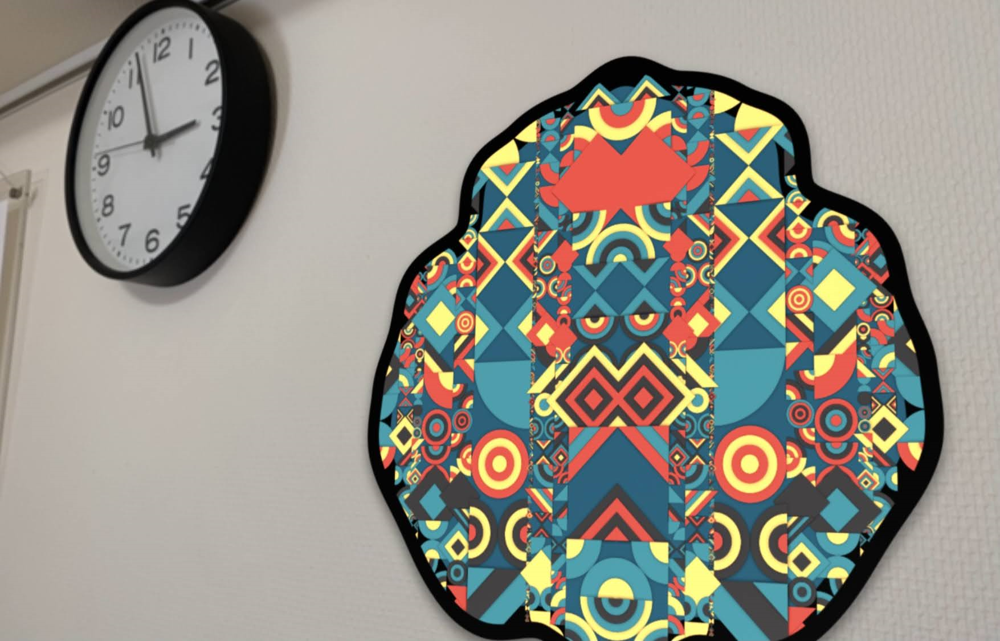
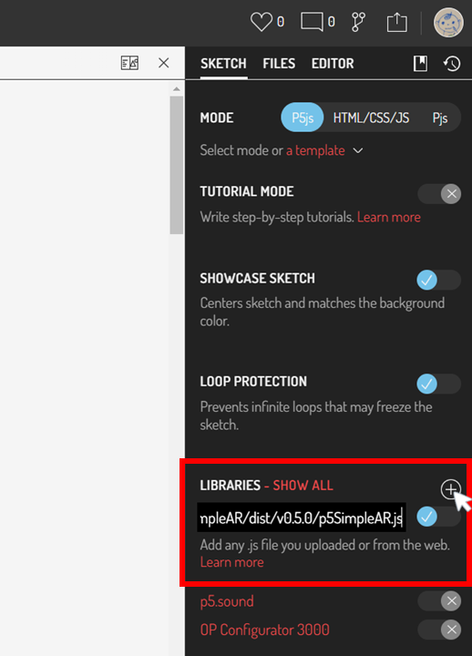

# Overview 👓

**p5.simpleAR** is a simple JavaScript supplement(mini-library) file to easily convert existing sketches into AR for PCs and smart devices.  
mp4埋め込みたい🌟  
[HQ movie.](https://youtu.be/I2mgpdLRX3g)

Now, the latest version is `0.5.0`(prototype release).  

## Demos
First, Please print the marker below(or just view it on the phone).  
 

[Marker](https://tetunori.github.io/p5.simpleAR/images/6wFrame.png)

### Basic Demo

https://user-images.githubusercontent.com/14086390/230766242-8c15c1ae-b734-4790-9f74-b3de3d875d8f.mp4

- [Basic Demo On GitHub](https://tetunori.github.io/p5.simpleAR/sample/basic/index.html), [Source code On GitHub](https://github.com/tetunori/p5.simpleAR/tree/main/sample/basic/)
- [Basic Demo On OpenProcessing](https://openprocessing.org/sketch/1891727)

### Other demos
<details><summary>CLICK ME to show other demos</summary>

#### Standard samples
##### [221105a on WebAR](https://openprocessing.org/sketch/1891678)  

https://user-images.githubusercontent.com/14086390/230766268-0836fc4d-a050-4c94-8485-4c8a0a1a8cb2.mp4

Original sketch by [@takawo](https://twitter.com/takawo)  

##### [Nagumo on WebAR](https://openprocessing.org/sketch/1891684)  

https://user-images.githubusercontent.com/14086390/230766284-756c01a2-37f0-4f53-955d-d511d16ac827.mp4

Original sketch by [@deconbatch](https://twitter.com/deconbatch)  

#### Transparent background
##### [Generativemasks on WebAR](https://openprocessing.org/sketch/1891862)

<br>
[Generativemasks](https://generativemasks.io/) by [@takawo](https://twitter.com/takawo), [Garg library](https://jp.deconbatch.com/2021/10/garg.html) by [@deconbatch](https://twitter.com/deconbatch)

#### Non-square canvas(800*80)
##### [Game of Life on WebAR](https://openprocessing.org/sketch/1891716)  

https://user-images.githubusercontent.com/14086390/230766289-28826124-1bbd-400a-bdb7-07e176d5e0d0.mp4

</details>

# Usage
## Import
```html 
<script src="https://tetunori.github.io/p5.simpleAR/dist/v0.5.0/p5SimpleAR.js"></script>
```
<details><summary>In case of OpenProcessing</summary>
 
</details>


## Basic Usage
Just replace `createCanvas` in `setup` with `createARCanvas`.

```javascript
createCanvas(100, 100);
->
createARCanvas(100, 100);
```
OK, done.  
Then, your sketch will be shown on the [AR Marker](https://github.com/nicolocarpignoli/artoolkit-barcode-markers-collection/blob/master/3x3/6.png).

## Environment 
This function deeply depends on **AR.js**. Please see the [requirement](https://ar-js-org.github.io/AR.js-Docs/#requirements) of the library. 

# API Specification
<details><summary>CLICK ME</summary>
<p>

## createARCanvas
```javascript
createARCanvas(w, h, [renderer], [params])
```
Replace `createCanvas` in `setup` with this function.  
So, basically, this has same parameters as `createCanvas`.  
> **Warning**  
> AR function does not work well in `WEBGL` mode...

`params` is original `Object` parameters for p5.simpleAR.  
Members:
|  name  |  note  |
| ---- | ---- |
|  `scale`   | `Number`: Scale of sketch. Marker size is defined as `1`. Default value is `3`. |

```javascript
// Call like this
// createCanvas(100, 200);
createARCanvas(100, 200, P2D, {scale: 5});
```

</p>
</details>

# ToDo
- Specify some parameters on AR setting
- Pinch to zoom in and out
- Support multiple types of markers
- Use specified image as a marker (possible?)
- Improve Performance 

# License
MIT license  
Copyright (c) 2023 [Tetsunori Nakayama](https://twitter.com/tetunori_lego).

# Author
Tetsunori Nakayama.

# References
- [AR.js](https://ar-js-org.github.io/AR.js-Docs/) by [AR-js-org](https://github.com/AR-js-org)
- [AR Maker](https://github.com/nicolocarpignoli/artoolkit-barcode-markers-collection) by [nicolocarpignoli](https://github.com/nicolocarpignoli)

